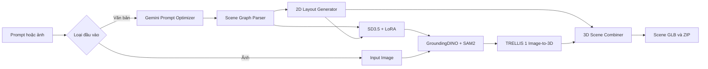

# SpatialFlow — AI 3D Scene Studio

SpatialFlow là ứng dụng web tạo cảnh 3D từ mô tả văn bản hoặc ảnh tham chiếu. Hệ thống phân tích vật thể, xác định quan hệ không gian, sinh ảnh 2D, tách vật thể, dựng mesh bằng TRELLIS và ghép thành cảnh `.glb` để xem trực tiếp trên trình duyệt.


## Tính năng

- Nhập prompt tiếng Việt hoặc tiếng Anh để tạo cảnh nhiều vật thể.
- Tải ảnh tham chiếu để chạy nhánh Image-to-3D.
- Theo dõi pipeline bằng workflow graph trực quan.
- Phân tích vật thể và quan hệ bằng Scene Graph Parser.
- Tạo bố cục 2D bằng bounding box trước khi ghép cảnh 3D.
- Sinh ảnh vật thể bằng SD3.5 và LoRA.
- Định vị, tách nền bằng GroundingDINO và SAM2.
- Dựng từng vật thể thành mesh GLB bằng TRELLIS 1.
- Ghép các mesh theo bố cục và quan hệ không gian.
- Xem GLB/PBR, xoay 360°, zoom, đổi góc nhìn và xem wireframe.
- Chỉnh màu, độ nhám và độ kim loại của vật liệu trên web.
- Tải model riêng, scene tổng hợp hoặc gói ZIP kết quả.

## Kiến trúc pipeline



### Vai trò các thành phần

1. **Gemini Prompt Optimizer** chuẩn hóa prompt, giữ số lượng, vật liệu, màu sắc và kiểu dáng vật thể.
2. **Scene Graph Parser** trích xuất danh sách vật thể và các quan hệ như `right_of`, `in_front_of`, `next_to`.
3. **2D Layout Generator** chuyển quan hệ thành tọa độ bounding box tương đối.
4. **SD3.5 + LoRA** sinh ảnh 2D riêng cho từng vật thể.
5. **GroundingDINO + SAM2** tìm vùng vật thể và tạo crop RGBA không có nền.
6. **TRELLIS 1** chuyển crop ảnh của từng vật thể thành mesh 3D.
7. **Scene Combiner** chuẩn hóa hướng, tỷ lệ, vị trí và đóng gói scene GLB.

## Kiến trúc triển khai

```text
Trình duyệt
  index.html + LiteGraph + model-viewer
              │ HTTPS / JSON / GLB
              ▼
Ngrok tunnel
              │ chuyển tiếp đến cổng 8000
              ▼
FastAPI orchestrator :8000
  ├── SD3.5 worker          :8001
  ├── TRELLIS worker        :8002
  └── GroundingDINO + SAM2  :8003
```

FastAPI điều phối pipeline và quản lý `run_id`. Các worker giữ model AI riêng, còn Ngrok tạo HTTPS public endpoint để trình duyệt kết nối đến backend đang chạy trên Kaggle.

## Chạy nhanh

### 1. Frontend

Frontend là các file tĩnh, có thể chạy bằng Python HTTP server:

```bash
python -m http.server 5500
```

Mở `http://localhost:5500`, nhập URL Ngrok của backend rồi bấm **Connect**.

### 2. Backend trên Kaggle

1. Mở notebook [`api-3d.ipynb`](api-3d.ipynb).
2. Bật accelerator **GPU T4**.
3. Tạo các Kaggle Secrets: `HF_TOKEN`, `GEMINI_API_KEY`, `NGROK_TOKEN`, `APP_API_KEY`.
4. Chạy tuần tự các cell trong notebook.
5. Chờ preflight báo `BACKEND PREFLIGHT PASSED`.
6. Chờ ba worker và FastAPI báo `READY`.
7. Sao chép `PUBLIC_API_URL` vào giao diện web.

Notebook sẽ clone repository vào `/kaggle/working`, cài dependency, chuẩn bị checkpoint GroundingDINO/SAM2, cài TRELLIS và khởi động các service:

```text
FastAPI       http://127.0.0.1:8000
SD3.5 worker  http://127.0.0.1:8001
TRELLIS       http://127.0.0.1:8002
SAM2/DINO     http://127.0.0.1:8003
```

### 3. Chạy backend local

Chỉ dùng cách này khi máy đã có đầy đủ CUDA, model và các extension của TRELLIS:

```bash
pip install -r requirements.txt
python worker_sd35.py --port 8001
python worker_trellis.py --port 8002
python worker_sam2_dino.py --port 8003
uvicorn server:app --host 0.0.0.0 --port 8000
```

## Cấu hình môi trường

```env
HF_TOKEN=...
GEMINI_API_KEY=...
NGROK_TOKEN=...
APP_API_KEY=...
ALLOWED_ORIGINS=https://your-frontend.example
SD35_LORA_PATH=/kaggle/working/lora_sd35_fast_safe/best
SD35_LORA_SCALE=0.2
MAX_TRELLIS_QUEUE=4
RUN_TTL_SECONDS=21600
MAX_STORED_RUNS=20
```

Không commit token, API key, model weights hoặc file kết quả sinh ra vào repository.

## API chính

| Method | Endpoint | Chức năng |
|---|---|---|
| `GET` | `/api/health` | Kiểm tra FastAPI, GPU và worker |
| `POST` | `/api/runs` | Tạo phiên chạy mới |
| `DELETE` | `/api/runs/{run_id}` | Xóa dữ liệu phiên |
| `POST` | `/api/runs/{run_id}/cancel` | Dừng phiên đang chạy |
| `POST` | `/api/optimize_prompt` | Tối ưu prompt bằng Gemini |
| `POST` | `/api/parse_scene_graph` | Phân tích vật thể và quan hệ |
| `POST` | `/api/generate_layout` | Tạo bố cục 2D |
| `POST` | `/api/generate_image` | Sinh ảnh 2D bằng SD3.5 |
| `POST` | `/api/upload_image` | Nhập ảnh tham chiếu |
| `POST` | `/api/run_sam2` | Tách vật thể thành crop RGBA |
| `POST` | `/api/generate_3d` | Đưa vật thể vào hàng đợi TRELLIS |
| `GET` | `/api/generate_3d/status/{job_id}` | Theo dõi tiến trình TRELLIS |
| `POST` | `/api/combine_scene` | Ghép các mesh thành scene GLB |
| `POST` | `/api/edit_material` | Chỉnh vật liệu trực tiếp trên GLB |
| `POST` | `/api/edit_3d_variant` | Tạo biến thể 3D theo prompt |

## Cấu trúc file chạy

```text
DATN-3d/
├── index.html                 # Giao diện web và workflow graph
├── product.css                # CSS giao diện sản phẩm
├── app_background.png         # Hình nền giao diện
├── server.py                  # FastAPI orchestrator
├── worker_sd35.py             # Worker SD3.5 + LoRA
├── worker_sam2_dino.py        # Worker GroundingDINO + SAM2
├── worker_trellis.py          # Worker TRELLIS 1
├── requirements.txt           # Dependency Python
├── api-3d.ipynb               # Notebook triển khai Kaggle
├── src/
│   ├── parser.py              # Scene graph parser
│   ├── layout.py              # Bố cục 2D/3D
│   ├── generator_2d.py        # Gọi worker sinh ảnh
│   ├── segmenter.py           # Gọi worker tách vật thể
│   ├── generator_3d.py        # Gọi worker TRELLIS
│   ├── combiner.py            # Ghép scene GLB
│   └── materials.py           # Chỉnh vật liệu GLB
└── tests/                     # Kiểm thử các module lõi
```

## Kiểm thử

```bash
python -m unittest discover -s tests -v
```

Các test tập trung vào parser, scene graph, layout, tách asset, đường dẫn run, xử lý vật liệu và khôi phục lỗi VRAM.

## Giới hạn

- Kaggle có thể tự dừng runtime; heartbeat chỉ phát hiện trạng thái, không ngăn được việc Kaggle tắt phiên.
- Chất lượng mesh phụ thuộc vào ảnh đầu vào, nền, mask và góc nhìn.
- TRELLIS dựng hình từ một ảnh nên các mặt bị che khuất có thể được suy đoán.
- Tạo cảnh nhiều vật thể cần nhiều thời gian và VRAM hơn tạo một vật thể.

## Công nghệ sử dụng

FastAPI · Python · Gemini · Stable Diffusion 3.5 · LoRA · GroundingDINO · SAM2 · TRELLIS 1 · Trimesh · LiteGraph · Three.js/model-viewer · Ngrok.

## Giấy phép và ghi nhận

Đây là đồ án nghiên cứu/sản phẩm thử nghiệm. Các model và thư viện bên thứ ba tuân theo giấy phép riêng của từng dự án.

---

**SpatialFlow — From a natural-language idea to an interactive 3D scene.**
