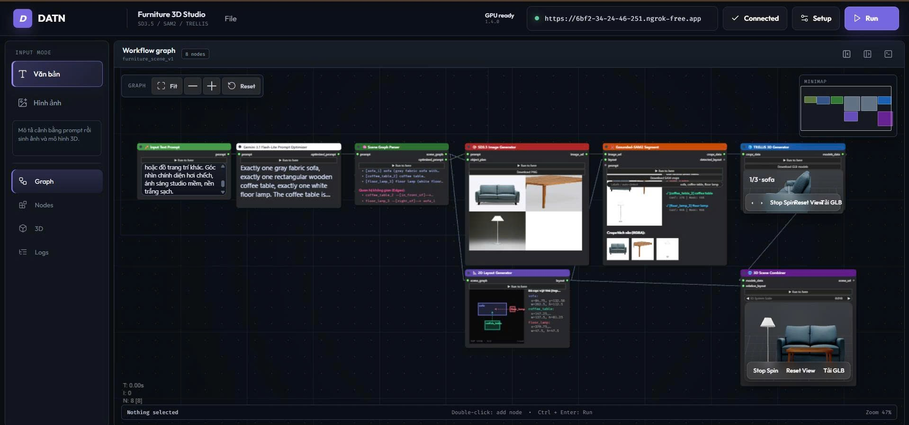
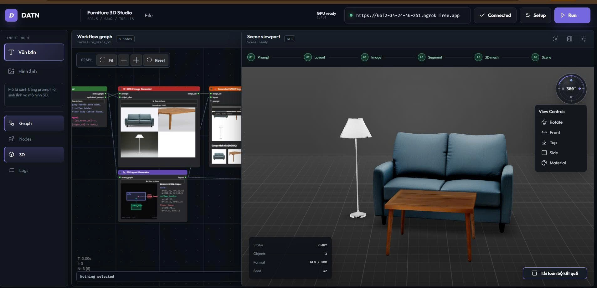
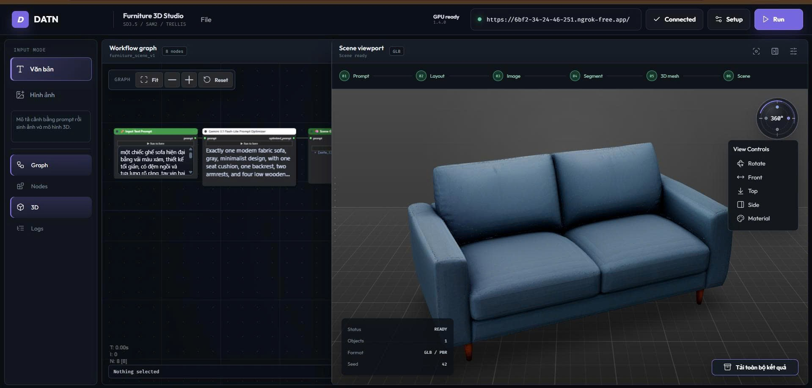
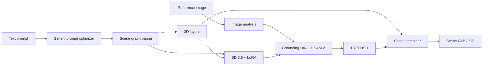

# SceneForge — Generative 3D Studio

**Turn text prompts and reference images into interactive 3D scenes.**

SceneForge is a research prototype that generates object-level 3D assets, arranges them into a scene, and lets you inspect and export the result as GLB.

[Demo](#screenshots) · [Features](#features) · [Architecture](#architecture) · [Getting Started](#getting-started) · [API](#api-reference)

## Screenshots

### End-to-End Workflow



### Generated 3D Scene



### Individual Model Viewer



## Features

- **Text-to-3D:** Generate multi-object scenes from Vietnamese or English prompts.
- **Image-to-3D:** Use a reference image as input to the object detection and segmentation workflow.
- **Scene planning:** Parse objects and spatial relationships, then preview placements as 2D bounding boxes.
- **Object generation:** Generate per-object images with SD 3.5 Medium and LoRA; segment them with Grounding DINO and SAM 2.
- **3D reconstruction:** Convert RGBA object crops to GLB meshes with TRELLIS 1 and combine them into a scene.
- **Scene viewer:** Rotate, zoom, change viewpoints, inspect wireframes, and edit PBR materials in the browser.
- **Export:** Download individual models, complete scenes, or ZIP packages.

## Architecture


```mermaid
flowchart LR
    A[Text prompt] --> B[Gemini prompt optimizer]
    B --> C[Scene graph parser]
    C --> D[2D layout]
    C --> E[SD 3.5 + LoRA]
    D --> E
    F[Reference image] --> G[Image analysis]
    G --> H[Grounding DINO + SAM 2]
    E --> H
    H --> I[TRELLIS 1]
    D --> J[Scene combiner]
    I --> J
    J --> K[Scene GLB / ZIP]
```

The text workflow plans object relationships and generates an image for each object. The reference-image workflow analyzes the uploaded image. Both paths use segmentation and TRELLIS to create object meshes, which the scene combiner places into the final GLB.

### Deployment

```text
Browser: index.html + LiteGraph + model-viewer
                         │ HTTPS / JSON / GLB
                         ▼
                    ngrok tunnel
                         │
                         ▼
FastAPI orchestrator :8000
  ├── SD 3.5 worker                  :8001
  ├── TRELLIS 1 worker               :8002
  └── Grounding DINO + SAM 2 worker  :8003
```

The FastAPI service manages runs, output files, and the TRELLIS queue. Each worker hosts its own model. The Kaggle notebook is configured for a GPU T4 and exposes the backend through ngrok.

## Getting Started

### 1. Start the backend on Kaggle

Use [`api-3d.ipynb`](api-3d.ipynb) with a GPU T4 accelerator. Add these Kaggle Secrets before running the notebook:

- `HF_TOKEN`
- `GEMINI_API_KEY`
- `NGROK_TOKEN`
- `APP_API_KEY`

Run the notebook cells in order. Once preflight succeeds and the workers report `READY`, copy `PUBLIC_API_URL` for the frontend. Kaggle may stop runtimes; restart the notebook and reconnect with its new URL when needed.

### 2. Serve the frontend

From the repository root, run:

```bash
python -m http.server 5500
```

Open <http://localhost:5500>, enter the backend URL, and connect. If the frontend is hosted on a different origin, add that origin to the backend's `ALLOWED_ORIGINS` setting.

### Local backend (optional)

Local inference requires CUDA, the model checkpoints, and the TRELLIS extensions. Install dependencies:

```bash
pip install -r requirements.txt
```

Start each worker and the API in a separate terminal:

```bash
python worker_sd35.py --port 8001
```

```bash
python worker_trellis.py --port 8002
```

```bash
python worker_sam2_dino.py --port 8003
```

```bash
uvicorn server:app --host 0.0.0.0 --port 8000
```

## Configuration

Configure the backend through environment variables. Keep secrets in Kaggle Secrets or the deployment environment; do not commit them to the repository.

```env
HF_TOKEN=...
GEMINI_API_KEY=...
NGROK_TOKEN=...
APP_API_KEY=...
ALLOWED_ORIGINS=https://your-frontend.example
SD35_LORA_PATH=/kaggle/working/lora_sd35_fast_safe/best
SD35_LORA_SCALE=0.2
MAX_TRELLIS_QUEUE=4
RUN_TTL_SECONDS=21600
MAX_STORED_RUNS=20
```

When `APP_API_KEY` is set, resource-intensive API routes require the `x-api-key` header. `GET /api/health` is available for health checks. Never commit tokens, API keys, model weights, or generated data.

## API Reference

| Method | Endpoint | Description |
|---|---|---|
| `GET` | `/api/health` | Check API, GPU, and worker status |
| `POST` | `/api/runs` | Create a run |
| `DELETE` | `/api/runs/{run_id}` | Delete run data |
| `POST` | `/api/runs/{run_id}/cancel` | Cancel a running job |
| `POST` | `/api/optimize_prompt` | Optimize a prompt with Gemini |
| `POST` | `/api/parse_scene_graph` | Parse objects and relationships |
| `POST` | `/api/generate_layout` | Calculate the 2D/3D layout |
| `POST` | `/api/generate_image` | Generate an object image with SD 3.5 |
| `POST` | `/api/upload_image` | Upload a reference image to a run |
| `POST` | `/api/run_sam2` | Detect and segment objects |
| `POST` | `/api/generate_3d` | Submit a crop to the TRELLIS queue |
| `GET` | `/api/generate_3d/status/{job_id}` | Check a 3D generation job |
| `POST` | `/api/combine_scene` | Combine meshes into a scene GLB |
| `POST` | `/api/edit_material` | Edit PBR materials in a GLB |
| `POST` | `/api/edit_3d_variant` | Create a variant from an existing model |

## Repository Structure

```text
DATN/
├── index.html                 # Web app and LiteGraph workflow
├── product.css                # User interface styles
├── server.py                  # FastAPI orchestrator
├── worker_sd35.py             # SD 3.5 + LoRA worker
├── worker_sam2_dino.py        # Grounding DINO + SAM 2 worker
├── worker_trellis.py          # TRELLIS 1 worker
├── api-3d.ipynb               # Kaggle deployment notebook
├── docs/images/               # Application demo screenshots
├── src/                       # Parsing, layout, generation, and scene utilities
└── tests/                     # Unit tests for core modules
```

## Testing

Run the unit test suite from the repository root:

```bash
python -m unittest discover -s tests -v
```

Tests cover scene graph parsing and layout, run paths, segmentation quality, scene assembly, GLB materials, and VRAM error recovery.

## Limitations

- TRELLIS reconstructs each object from a single image; hidden surfaces are inferred by the model.
- Mesh quality depends on the generated image, crop completeness, and segmentation mask.
- Multi-object scenes require sequential GPU processing and take longer than single-object generation.
- Kaggle runtimes may stop unexpectedly.

## Technology

Python · FastAPI · Gemini · Stable Diffusion 3.5 · LoRA · Grounding DINO · SAM 2 · TRELLIS 1 · Trimesh · LiteGraph · Three.js · model-viewer · ngrok

SceneForge is a research prototype. Third-party models and libraries are subject to their respective licenses.
